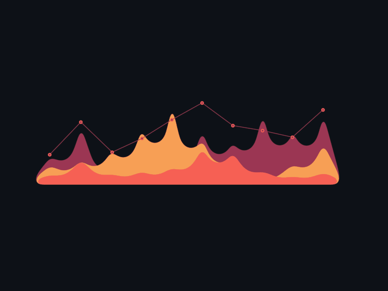

##### Biólogo e Mestre em Biologia Molecular, com ênfase em Bioinformática. Possui experiência com análise de dados, estatística e redação científica. Apresenta, como formação complementar, prática com QGIS, Office, Power BI, Linux e Python.

##### Interessado no estudo de metodologias/ferramentas que auxiliem na exploração de dados (biológicos ou não), de maneira a tornar sua interpretação acessível a todos; neste caminho, busca aprimorar seu conhecimento em análise com linguagem Python e em implementar o valor dos dados em modelos com fins práticos.

  <a href="https://github.com/chitolina">
  
  
    
 

 
 
 
 

  
 #### • Uso frequente:
 
 
 
 
   
  
 #### • Data Science:
 
 
 
 
 
  
 #### • Aprendendo:
  
 
 
 
 
  
  

  ##
 
####  • Dê uma olhada em meu portfólio: 
  

   
  
 

####  • Outros endereços:

   
     
    
     

